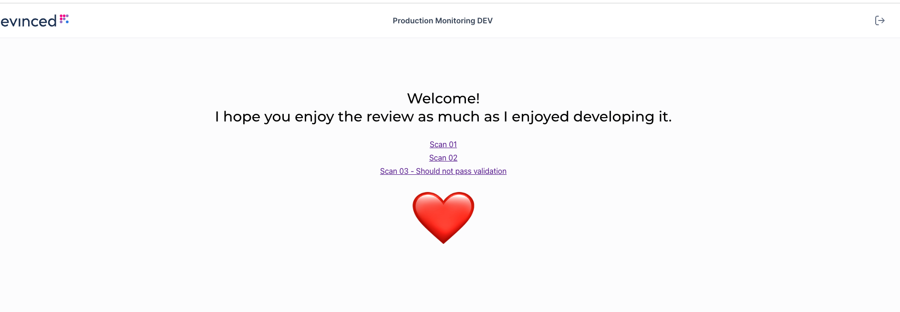

# Evinced | Frontend home assignment

## instructions

Create a simple React app with a single page, containing the following:

1. The card with a tree component on the left - where the nodes are segments of a URL, and an indication of the
   percentage of issues found on that segment (and its children)
   Use whatever 3rd party component you want, or implement one - the focus here is on implementing the logic to create
   the tree data from the given JSON (A sample JSON is attached)
2. The card with the table component on the right, showing the list of all issues relevant to the current tree
   selection. Only a simple static table is required here, without any interactions.
   Again, use whatever 3rd party component you want, or implement one - the focus is on the interaction between the two
   cards.
3. Add a switch component next to the 'Site Tree' label, to switch between having the tree nodes at each level sorted
   alphabetically or by descending percentage.
4. Add an input field next to the table card's label, to filter the table rows, so the table will show only rows where
   one of the cells contains the input's value.

## Available Scripts

In the project directory, you can run:

### `npm start`

Runs the app in the development mode.\
Open [http://localhost:3000](http://localhost:3000) to view it in your browser.

The page will reload when you make changes.\
You may also see any lint errors in the console.

### `npm test`

Launches the test runner in the interactive watch mode.\
See the section about [running tests](https://facebook.github.io/create-react-app/docs/running-tests) for more
information.
